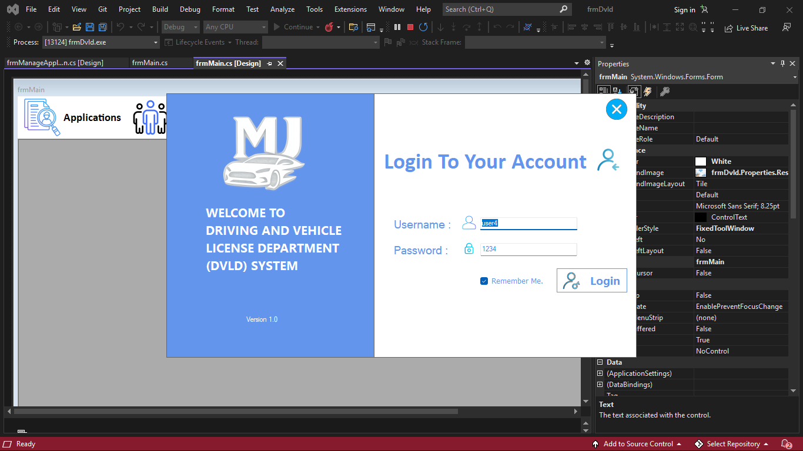
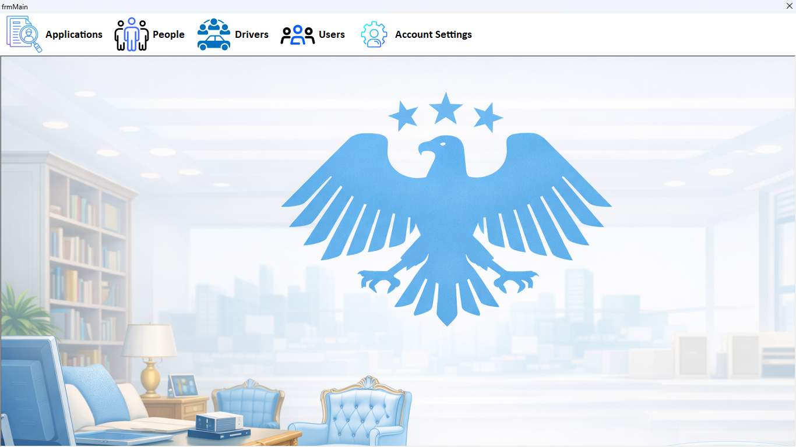
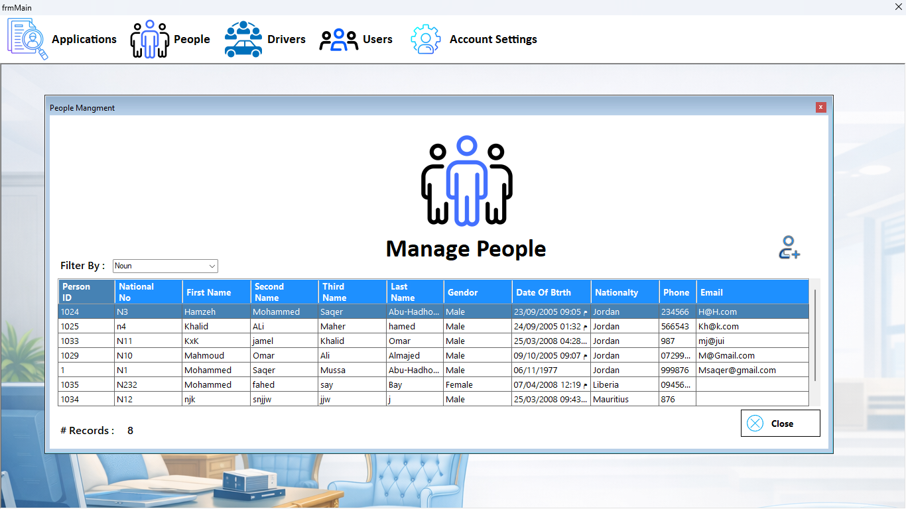
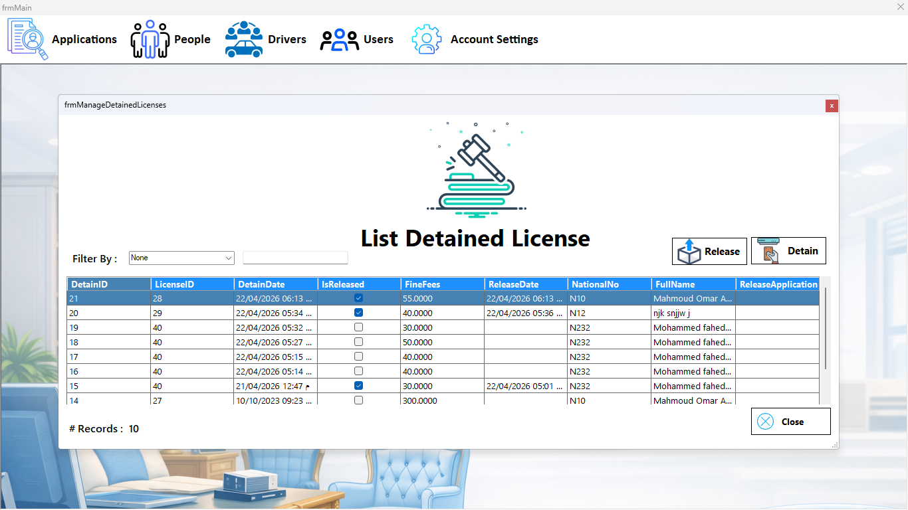

# DVLD Management System – Full Desktop Application

## 📝 Overview
This project is a practical desktop application built using **C# .NET WinForms** and **SQL Server**, designed to simulate a simplified version of a **Driver & Vehicle Licensing Department (DVLD)** system.

The goal of the project is to practice building a complete desktop system from scratch, including database design, UI development, CRUD operations, and applying real administrative logic.  
The system includes multiple modules, a structured database, and a clean user interface inspired by real government dashboards.

---

## 🎯 Project Goals
- Build a full desktop application from zero.
- Practice SQL Server database design and relationships.
- Implement CRUD operations using ADO.NET.
- Apply a simple 3‑Layer Architecture (UI → Business → Data Access).
- Build a multi-form system with real-world workflows.
- Design a clean, organized, and professional UI.

---

## 🧩 Main Features

### ✔ People Management
- Add, edit, delete, and search for people.
- Store personal information (Name, National No, Date of Birth, Address…).
- Input validation to prevent incorrect data.

### ✔ Drivers Module
- Assign a person as a driver.
- Manage driver records.
- View driver history and related licenses.

### ✔ Licenses Module
- Issue new licenses.
- Renew existing licenses.
- Replace lost/damaged licenses.
- Cancel or suspend licenses.
- Track license status and expiration.

### ✔ Tests Module
- Manage test types (Vision, Written, Street).
- Register applicants for tests.
- Track passed/failed attempts.
- Prevent issuing a license unless all tests are passed.

### ✔ Authentication System
- Login form with username + password.
- Basic role handling (Admin / User).
- Restrict access to certain forms based on permissions.

### ✔ Database Integration
- SQL Server relational database.
- Tables for People, Drivers, Licenses, Tests, Users, and more.
- Stored procedures for cleaner and safer data operations.

### ✔ Clean UI Design
- Custom main dashboard with icons and shortcuts.
- Light professional theme.
- Organized forms and consistent layout.
- Custom background image designed specifically for the project.

---

## 🏗 Architecture
The project follows a clean **3‑Layer Architecture**:

### 1️⃣ Presentation Layer (UI)
- WinForms screens  
- Buttons, textboxes, grids, dialogs  
- User interaction and validation  

### 2️⃣ Business Layer
- Contains logic and rules  
- Validates operations before sending them to the database  

### 3️⃣ Data Access Layer
- ADO.NET commands  
- SQL queries and stored procedures  
- Connection string handling  

---

## 🗄 Database Structure
The SQL Server database includes the following main tables:

- People  
- Drivers  
- Licenses  
- LicenseClasses  
- Tests  
- TestTypes  
- Users  
- Applications  

Each table is connected using proper foreign keys to simulate real DVLD workflows.

---

## 🔌 Technologies Used
- C# .NET WinForms  
- SQL Server  
- ADO.NET  
- 3‑Layer Architecture  
- Stored Procedures  
- Object-Oriented Programming  

---

## 🚀 How to Run the Project
1. Restore the SQL Server database (.bak file).  
2. Update the connection string in the project to match your SQL Server instance.  
3. Open the solution in Visual Studio.  
4. Build and run the project.  
5. Login using the default credentials (if provided).  
---
## 🗄 Database

The DVLD Management System relies on a structured SQL Server database that contains all core entities required for managing people, drivers, licenses, tests, and user accounts.  
To run the project successfully, the database must be restored and connected properly.

### 1️⃣ Restoring the Database
To restore the database:

1. Open **SQL Server Management Studio (SSMS)**.
2. Right‑click **Databases** → **Restore Database**.
3. Select the provided `.bak` file.
4. Complete the restore process.
5. Ensure the database name matches the one used in the project (e.g., `DVLD`).

### 2️⃣ Main Tables
The database includes the following essential tables:

- **People** – Stores personal information.  
- **Drivers** – Links people to driver records.  
- **Licenses** – Stores issued licenses and their statuses.  
- **LicenseClasses** – Defines license categories.  
- **Applications** – Tracks license applications.  
- **Tests** – Stores test attempts and results.  
- **TestTypes** – Defines test categories (Vision, Written, Street).  
- **Users** – Stores system login accounts.

These tables are connected using foreign keys to simulate real DVLD workflows and ensure data consistency.

### 3️⃣ Updating the Connection String
After restoring the database, update the connection string:

- Open the project in Visual Studio.
- Navigate to:  
  `DvldDataAccessLayer → DALClasses → ApplicationDB.cs`
- Replace the server name with your SQL Server instance:

### 4️⃣ Verifying the Connection
Once the connection string is updated:

- Build the solution.
- Run the application.
- Test login using the default credentials (if included).

If the application loads the dashboard without errors, the database connection is working correctly.

---
## 🛠 Installation

Follow these steps to set up and run the project on your machine:

### 1️⃣ Restore the Database
- Open SQL Server Management Studio.
- Right‑click on **Databases** → **Restore Database**.
- Select the `.bak` file included with the project.
- Complete the restore process.

### 2️⃣ Update the Connection String
- Open the project in Visual Studio.
- Go to:  
  `DvldDataAccessLayer → DALClasses → ApplicationDB.cs`
- Update the connection string to match your SQL Server instance name.

### 3️⃣ Build the Solution
- Open `DVLD19.sln` in Visual Studio.
- Click **Build → Build Solution**.

### 4️⃣ Run the Application
- Press **F5** or click **Start**.
- Login using the default credentials (if provided).

---

## 📦 Future Improvements
- Add reporting system (PDF / Excel).  
- Add user roles with more detailed permissions.  
- Add notifications for license expiration.  
- Improve UI with modern controls.  
- Convert the system to WPF or Web version.  

---

## 👤 Author
**MJ – Junior Desktop / Back-End Developer**  
C# .NET | SQL Server | WinForms | Desktop Applications  

---
## 📸 Screenshots

### 🔐 Login Screen

### 🏠 Main Dashboard

### 👤 People Management

### 🚗 Licenses Module

---
## ⭐ Why This Project Matters
This project demonstrates:
- Ability to build a complete system from scratch  
- Understanding of databases and CRUD  
- Capability to design and organize UI  
- Experience with real-world workflows  
- Readiness for junior developer roles  
